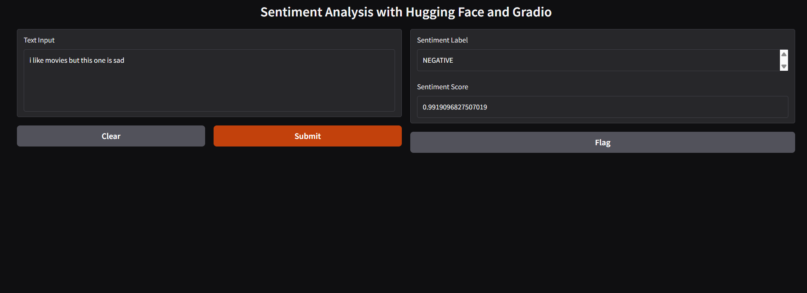

# Hugging face Lab -Built a simple sentimental analysis system

# contents
- Sentimental Analysis
- Model Used
- Gradio interface

## Sentimental Analysis
Sentimental analysis is the process of determining the emotional tone behind a series of words, used to gain an understanding of the attitudes, opinions, and emotions expressed within an online mention. It is commonly used in customer feedback analysis, social media monitoring, and market research.
In this lab, we will build a simple sentimental analysis system using the Hugging Face Transformers library.
## Model Used
I used the pre-trained model "distilbert-base-uncased-finetuned-sst-2-english" from Hugging Face. This model is a distilled version of BERT that has been fine-tuned on the Stanford Sentiment Treebank (SST-2) dataset for sentiment analysis tasks.

## Gradio
Gradio is an open-source Python library that allows you to quickly create and share web applications for machine learning models. It provides a simple interface for building interactive demos and prototypes, making it easy to showcase your models to others.

In this lab, I used Gradio to create a web interface for our sentimental analysis system, allowing users to input text and receive sentiment predictions in real-time.
Here is a simple implementation of a sentimental analysis system using Hugging Face and Gradio:

